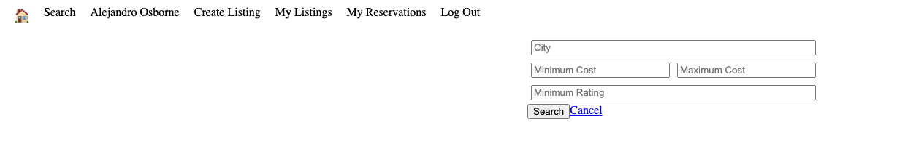

# LightBNB

### Description

LightBnB is a platform that allows users to book homes for vacations or long-term stays.

LightBnB allows users to create an account to make a listing, a booking or a reservation. Users can can also search for a home based on their inputted criteria. 


Users can create and sign in with an account, or create one. 


Users can search for properties based on their search criteria. 

### **Dependencies**

- PostgreSQL
- Express
- cookie-session 

### **Project Setup**

Fork and clone the project repository [here](https://github.com/mattyu123/lightBnB)

### **Server Setup**

First open up the project repository. 
``` 
cd LightBnB_WebApp-master 
``` 
to access the main project directory. 

To start the server, use `npm start`, the server will load on localhost:3000.

### **Database Setup**

The database can be setup with psql. Navigate to the project's directory, and type `psql` in the terminal window while in that same directory. 

Once there, run the following commands in this order:

```
# This creates the database 
\i migrations/01_schema.sql

# Downloads the seed data
\i seeds/01_seeds.sql
\i seeds/02_seeds.sql
```

The project is now setup and ready for use! 